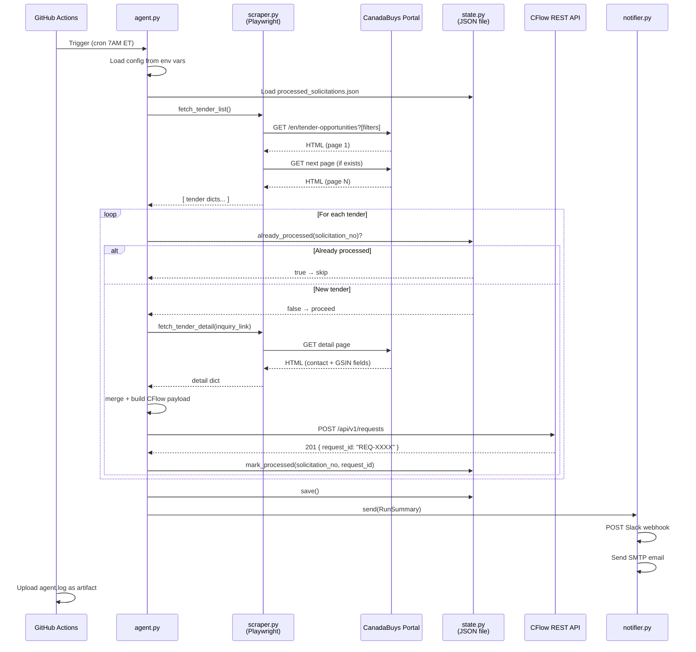
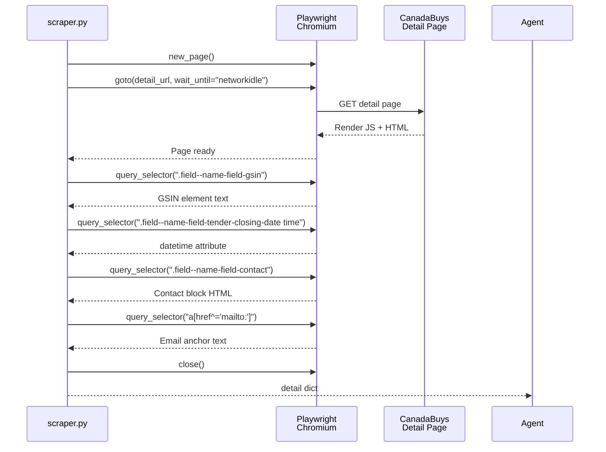

# RFC: CanadaBuys → CFlow Sourcing Intake Agent

**Author:** Iyakkam / Noel  
**Status:** Draft  
**Created:** March 2026  
**Related Docs:** `PRD.md`, `COMPETITIVE_ANALYSIS.md`, `USER_FLOWS.md`

---

## Summary

This RFC proposes a scheduled Python agent that replaces a manual two-step process — running the Data Miner Chrome plugin and hand-entering data into CFlow — with a fully automated daily pipeline. The agent uses Playwright (headless Chromium) to scrape the CanadaBuys federal tender portal, extracts 11 structured fields matching the client's existing Data Miner recipe, deduplicates against previously processed solicitations, and creates CFlow workflow requests via REST API. It is deployed as a GitHub Actions cron job running weekday mornings with zero infrastructure cost.

---

## Motivation

### Problem

The sourcing team currently spends time every weekday manually:
1. Opening Chrome and running a Data Miner recipe against a filtered CanadaBuys search URL
2. Taking the extracted CSV/table and manually filling in a CFlow intake form — 11 fields per tender, one at a time

This is pure mechanical repetition with no decision-making involved. The human adds no value at this stage — they are functioning as a data pipe. Any day the task is forgotten, delayed, or done partially, the team's sourcing pipeline narrows.

### Why Now

The client already has:
- A stable, working CFlow sourcing workflow with a defined form
- A stable, working Data Miner recipe that defines exactly which fields to extract
- A clear search URL encoding their exact category and status filters

All the hard thinking is done. The data model, the source, the destination, and the field mapping are all known. This RFC is purely about automating the mechanical transport layer between them. There is no design ambiguity, no unknown business logic — only execution.

---

## Proposed Solution

### Overview

A single Python process (`agent.py`) orchestrates five concerns:

1. **Configuration** — loads credentials and settings from environment variables
2. **Scraping** — Playwright navigates CanadaBuys, paginates through results, extracts listing and detail page fields
3. **Deduplication** — checks each solicitation number against a local JSON state file
4. **CFlow submission** — maps fields to the CFlow form and POSTs via REST API
5. **Notification** — sends a Slack and/or email run summary on completion

The agent is scheduled via GitHub Actions cron (`0 12 * * 1-5` — 7 AM ET) and runs entirely within the free tier (~5 min runtime vs. 2,000 min/month allowance).

---

### Technical Design

#### Components

| File | Responsibility |
|------|---------------|
| `agent.py` | Orchestrator — runs the pipeline, owns error handling and summary |
| `scraper.py` | Playwright browser session — fetches listing pages and detail pages, returns dicts |
| `cflow_client.py` | HTTPX async HTTP client — builds CFlow payload, POSTs to REST API |
| `state.py` | Reads/writes `processed_solicitations.json` — deduplication memory |
| `notifier.py` | Slack webhook + SMTP email — sends run summary |
| `config.py` | Loads `.env` or environment variables, validates required keys |
| `run.py` | CLI entrypoint with `--dry-run`, `--discover-fields`, `--visible`, `--reset-state` flags |
| `test_run.py` | Scrape-only dry run — prints payloads, no CFlow writes |
| `discover_fields.py` | One-time tool — queries CFlow API for workflow form field names |
| `.github/workflows/daily_agent.yml` | GitHub Actions cron schedule + secrets injection |

#### Data Structures

**Tender dict** (internal — produced by scraper, consumed by CFlow client):
```python
{
    "solicitation_title":  str,   # e.g. "IT Security Assessment Services"
    "solicitation_no":     str,   # e.g. "PW-EZZ-123-12345"  ← dedup key
    "gsin_description":    str,   # e.g. "EDP - Professional Services"
    "inquiry_link":        str,   # absolute URL to detail page
    "closing_date":        str,   # ISO 8601 or formatted date string
    "time_and_zone":       str,   # e.g. "14:00 Eastern"
    "notifications":       str,   # amendment count or notification text
    "client":              str,   # e.g. "Shared Services Canada"
    "contact_name":        str,
    "contact_email":       str,
    "contact_phone":       str,
}
```

**State file** (`processed_solicitations.json`):
```json
{
    "PW-EZZ-123-12345": {
        "cflow_request_id": "REQ-4821",
        "title": "IT Security Assessment Services",
        "processed_at": "2026-03-24T12:07:43Z"
    }
}
```

**CFlow REST payload** (POST `/api/v1/requests`):
```json
{
    "workflow_name": "Sourcing Workflow",
    "form_fields": {
        "Solicitation Title":  "IT Security Assessment Services",
        "Solicitation No":     "PW-EZZ-123-12345",
        "GSIN Description":    "EDP - Professional Services",
        "Inquiry Link":        "https://canadabuys.canada.ca/...",
        "Closing Date":        "2026-04-15",
        "Time and Zone":       "14:00 Eastern",
        "Notifications":       "0 amendments",
        "Client":              "Shared Services Canada",
        "Contact Name":        "Jane Smith",
        "Contact Email":       "jane.smith@ssc-spc.gc.ca",
        "Contact Phone":       "613-555-0100",
        "Source":              "CanadaBuys Auto-Agent"
    }
}
```

#### Sequence Diagram — Daily Run



#### Sequence Diagram — Scraper Detail Page Fetch



---

## Alternatives Considered

### Option A: Raw HTTP scraping (requests + BeautifulSoup)
- **Pros:** Faster execution (~2s vs ~15s per run), simpler dependency tree, no browser overhead
- **Cons:** CanadaBuys actively blocks via `robots.txt`; the portal uses JavaScript rendering for search results — raw HTML responses return empty result containers
- **Why not chosen:** Tested during research — `robots.txt` returns `ROBOTS_DISALLOWED` on the search endpoint. Even bypassing that, the results table is JS-rendered and not present in the raw HTML response. Playwright is mandatory.

### Option B: CanadaBuys RSS / Atom Feed
- **Pros:** Zero scraping risk, stable structured format, no browser dependency
- **Cons:** CanadaBuys does not publish a public RSS/Atom feed for filtered tender searches. The notification system requires a user account and delivers email only — no programmatic feed exists for the specific category/status filter combination the client uses.
- **Why not chosen:** Feed does not exist for this use case.

### Option C: Zapier / Make.com automation
- **Pros:** No-code, visual, easy for non-developers to maintain
- **Cons:** No Zapier or Make connector exists for CanadaBuys (it's not a mainstream SaaS product). Would require a custom webhook/API trigger which itself needs a scraper to feed it — the hard problem is not solved. Additionally, Zapier's CFlow connector supports basic record creation but field-level mapping for a custom workflow form would require custom code anyway.
- **Why not chosen:** Doesn't solve the scraping problem. Adds a paid middleware layer with no real benefit over direct Python.

### Option D: Schedule via OS cron on a VPS/server
- **Pros:** More control, no GitHub dependency, can run more frequently if needed
- **Cons:** Requires a persistent server (~$5–10/month), server maintenance, uptime monitoring, SSH access management. Over-engineered for a 5-minute daily task.
- **Why not chosen:** GitHub Actions free tier is more than sufficient. Zero infrastructure cost and zero server maintenance for the client.

### Option E: Selenium instead of Playwright
- **Pros:** Mature, widely documented
- **Cons:** Playwright is strictly superior for this use case — faster, native async support (no `asyncio` workarounds needed), built-in `wait_until="networkidle"` which handles JS-heavy pages cleanly, and simpler browser management. Playwright also has better Chromium stealth defaults that reduce anti-bot detection.
- **Why not chosen:** Playwright is the better tool for every relevant dimension.

### Option F: Store state in a database (SQLite, Postgres)
- **Pros:** More robust querying, easier to inspect, supports future features (dashboards, amendment tracking)
- **Cons:** Adds a dependency, complicates GitHub Actions setup (ephemeral filesystem means DB must be committed back to repo or stored externally), over-engineered for a simple set of processed IDs
- **Why not chosen:** A JSON file committed to the repo (or cached via GitHub Actions cache) is sufficient for MVP deduplication. SQLite can be adopted in v2 if dashboard/query features are added.

---

## Implementation Plan

### Phase 0: Environment Setup (Day 1 morning)
- [ ] Clone repo, create Python venv, install dependencies
- [ ] Run `playwright install chromium`
- [ ] Copy `.env.example` → `.env`, fill in CFlow credentials
- [ ] Run `python run.py --discover-fields` — verify CFlow connectivity and retrieve form field names
- [ ] Update `_build_payload()` in `cflow_client.py` with confirmed field names

### Phase 1: Scraper Validation (Day 1 afternoon)
- [ ] Run `python run.py --dry-run --limit 5 --visible` — watch browser scrape CanadaBuys
- [ ] Confirm all 11 fields appear in printed payloads
- [ ] If any fields are empty: inspect detail page HTML, update CSS selectors in `scraper.py`
- [ ] Run `python run.py --dry-run --limit 5` (headless) — confirm identical results

### Phase 2: CFlow Integration Test (Day 2)
- [ ] Run `python run.py` with `CFLOW_SUBMIT_NOW=false` — create 3 draft records
- [ ] Log into CFlow, verify draft records — confirm all 11 fields populated correctly
- [ ] Get sign-off from sourcing team member that records look correct
- [ ] Delete test draft records from CFlow
- [ ] Run one full live submission: `python run.py --limit 1`
- [ ] Confirm submitted record appears correctly in CFlow sourcing workflow inbox

### Phase 3: Notification Setup (Day 2)
- [ ] Configure Slack incoming webhook (or SMTP credentials) in `.env`
- [ ] Trigger test run, confirm notification received with correct summary format
- [ ] Verify error notification path by temporarily using wrong CFlow API key

### Phase 4: GitHub Actions Deployment (Day 3)
- [ ] Push repo to GitHub (private repository)
- [ ] Add all `CFLOW_*` variables as GitHub Actions repository secrets
- [ ] Enable workflow in Actions tab
- [ ] Trigger manual run (`Actions → Run workflow`) — confirm end-to-end success in logs
- [ ] Confirm log artifact uploaded and downloadable
- [ ] Verify `processed_solicitations.json` state persists across runs via Actions cache

### Phase 5: Parallel Run & Validation (Weeks 1–2)
- [ ] Agent runs daily alongside existing Data Miner manual process
- [ ] Sourcing team compares CFlow records created by agent vs. Data Miner output daily
- [ ] Document any discrepancies (missing fields, wrong values)
- [ ] Fix and redeploy as needed within 24 hours
- [ ] After 5 consecutive clean matching runs: proceed to retirement

### Phase 6: Data Miner Retirement (End of Week 2)
- [ ] Sourcing manager confirms agent output matches expectations
- [ ] Remove Data Miner recipe / Chrome plugin from sourcing team's workflow
- [ ] Update team SOP documentation: "CFlow intake is now automated"
- [ ] Agent becomes sole intake mechanism

### Dependencies
- CFlow account with API access enabled (Admin → Security Settings → API Settings)
- GitHub account with Actions enabled (free tier sufficient)
- Slack workspace with Incoming Webhooks app installed (if using Slack notifications)
- Python 3.12+ on developer's local machine for setup and validation phases

---

## Risks & Mitigations

| Risk | Likelihood | Impact | Mitigation |
|------|-----------|--------|------------|
| CanadaBuys restructures HTML, breaking CSS selectors | Medium | High — agent returns 0 results silently | `total_found=0` sends a warning notification; `--dry-run --visible` provides fast diagnosis; selectors are isolated in `scraper.py` for easy patching |
| CFlow API contract changes (endpoint, auth, field names) | Low | High — all submissions fail | Error count in notification triggers immediate investigation; `discover_fields.py` re-validates mapping; CFlow is a stable commercial SaaS |
| GitHub Actions deprecates free cron scheduling | Very Low | Medium — scheduling breaks | Trivial to migrate to any cron alternative (server cron, AWS EventBridge, etc.) — the Python agent itself is scheduler-agnostic |
| Solicitation number format changes on CanadaBuys | Low | Medium — dedup key becomes unreliable | State file includes title as secondary identifier; worst case is one duplicate run; format is a government standard unlikely to change |
| CFlow rate limiting rejects rapid sequential POSTs | Low | Low — some submissions delayed | Failed tenders are retried automatically on next run (not in state file); can add `asyncio.sleep(1)` between POSTs if needed |
| Detail page structure differs from listing page structure | Medium | Low — some fields missing | Fields fall back to empty string gracefully; `--dry-run` reveals gaps before go-live |
| GitHub Actions ephemeral runner loses state file | Low | Medium — re-processes all tenders | State file cached between runs using `actions/cache`; worst case is one duplicate batch on cache miss |
| CanadaBuys adds Cloudflare / CAPTCHA protection | Low | High — all scraping blocked | Playwright with realistic browser fingerprint handles standard Cloudflare; `slow_mo` setting adds human-like timing; escalation path: proxy service or CanadaBuys API (if PSPC publishes one) |

---

## Open Questions

- [ ] **CFlow staging environment:** Does the client have a CFlow sandbox/staging instance for integration testing, or will Phase 2 testing run against production with draft records?
- [ ] **CFlow workflow name:** What is the exact name of the sourcing workflow as configured in CFlow? (Required for `CFLOW_WORKFLOW_NAME` env var — must match exactly)
- [ ] **Notification preference:** Slack or email? If Slack — which channel? If email — which recipient address and which SMTP provider?
- [ ] **Run time preference:** 7 AM ET is assumed. Does the sourcing team prefer a different time — e.g. end-of-day so records are waiting in CFlow the next morning?
- [ ] **GitHub repository:** Will the client host this in their own GitHub org, or will it be maintained by the developer and deployed on their behalf?
- [ ] **Amendment handling (future):** If a tender already in CFlow receives an amendment on CanadaBuys, should the agent update the existing CFlow record or create a new one? Not required for MVP but worth flagging now.

---

## Phase 2: Intelligent Intake Pipeline (April 2026)

### Overview

Phase 2 evolves the agent from a fully automated batch pipeline into a **human-in-the-loop intelligent intake system** with LLM-powered document extraction, SAP integration, associate workload management, and a review dashboard.

### New Pipeline Architecture

```
Phase 1 (Automated — GitHub Actions cron):
  CanadaBuys scrape → detail extraction → SAP/direct detection
    → solicitation download (CanadaBuys direct OR SAP auto-login)
    → LLM extraction (summary, requirements, criteria, submission method)
    → multi-inquiry detection (Regular vs Multiple + CSV export)
    → associate round-robin assignment
    → stage to PostgreSQL (status: pending_review)

Phase 2 (Manual — Dashboard):
  User reviews staged tenders on Vercel dashboard
    → Accept → CFlow submit + file upload
    → Reject → mark rejected, never reprocessed
```

### Technology Additions

| Component | Technology | Rationale |
|-----------|-----------|-----------|
| **Database** | PostgreSQL on Railway | Replaces JSON state file; supports structured queries, associate tracking, tender status workflow |
| **Dashboard** | Next.js on Vercel (free tier) | Accept/reject gate, associate workload view, tender detail display |
| **LLM extraction** | Claude API (Anthropic) | Extract summary, requirements, mandatory criteria, submission method from solicitation PDFs |
| **SAP automation** | Playwright (same browser context) | Auto-login to SAP Business Network for solicitation download |

### Data Model (PostgreSQL)

```sql
-- Tenders table (replaces processed_solicitations.json)
CREATE TABLE tenders (
    id              SERIAL PRIMARY KEY,
    solicitation_no VARCHAR(100) UNIQUE,
    solicitation_title TEXT,
    inquiry_link    TEXT,
    closing_date    VARCHAR(20),
    time_and_zone   VARCHAR(50),
    client          TEXT,
    contact_name    TEXT,
    contact_email   TEXT,
    contact_phone   TEXT,
    gsin            TEXT,
    bid_platform    VARCHAR(20),       -- 'CanadaBuys' or 'SAP'
    file_type       VARCHAR(20),       -- 'Regular' or 'Multiple'
    submission_method VARCHAR(50),     -- 'E-post' / 'FAX' / 'E-mail' / 'SAP'
    summary_of_contract TEXT,
    requirements    TEXT,
    mandatory_criteria TEXT,
    solicitation_path TEXT,            -- local file path (temp) or S3 URL
    requirements_csv_path TEXT,        -- CSV for multi-inquiry tenders
    assigned_associate VARCHAR(50),
    status          VARCHAR(20) DEFAULT 'pending_review',
                                       -- pending_review → accepted → submitted / rejected
    cflow_record_id VARCHAR(50),
    scraped_at      TIMESTAMP DEFAULT NOW(),
    reviewed_at     TIMESTAMP,
    submitted_at    TIMESTAMP,
    created_at      TIMESTAMP DEFAULT NOW()
);

-- Associates table
CREATE TABLE associates (
    id              SERIAL PRIMARY KEY,
    name            VARCHAR(50) UNIQUE NOT NULL,
    active          BOOLEAN DEFAULT TRUE,
    last_assigned_at TIMESTAMP
);

-- Seed data
INSERT INTO associates (name) VALUES
    ('Edward'), ('Richard'), ('Jack'), ('John'), ('James');
```

### SAP Auto-Login Flow

```
1. Tender detail page contains "SAP Business Network" text
2. Agent follows the SAP link from the tender page
3. Playwright logs in using SAP_USERNAME + SAP_PASSWORD from .env
4. Navigates to the solicitation document section
5. Downloads solicitation PDF(s)
6. Falls back to flagging if login fails (MFA, CAPTCHA, session expired)
```

### LLM Document Extraction

After downloading a solicitation PDF, the agent sends it to Claude API:

```python
prompt = """Extract these fields from this solicitation document:
1. Summary of Contract — 2-3 sentence overview
2. Requirements — if single item, describe it; if table of items, return as structured JSON
3. Mandatory Criteria — list all mandatory criteria
4. Submission Method — one of: E-post, FAX, E-mail, SAP

If requirements are a multi-item table, also return the table data as JSON
with columns: Item, GSIN, NSN, Description, Part No, NCAGE, Quantity,
Unit of Issue, Destination, Packaging.
"""
```

**Multi-inquiry detection:** If the LLM returns a requirements table with >1 row, the tender is classified as "Multiple" and a CSV is generated. Otherwise it's "Regular".

### Associate Round-Robin

```python
# Get next associate (round-robin by last_assigned_at)
SELECT name FROM associates
WHERE active = TRUE
ORDER BY last_assigned_at ASC NULLS FIRST
LIMIT 1;

# After assignment
UPDATE associates SET last_assigned_at = NOW() WHERE name = ?;
```

### Dashboard API (Next.js API routes on Vercel)

| Endpoint | Method | Purpose |
|----------|--------|---------|
| `/api/tenders` | GET | List tenders with filters (status, associate, date range) |
| `/api/tenders/[id]/accept` | POST | Accept tender → triggers CFlow submission |
| `/api/tenders/[id]/reject` | POST | Reject tender → marks as rejected |
| `/api/associates` | GET | List associates with workload counts |
| `/api/associates/[name]/tenders` | GET | Tenders assigned to specific associate |

### Risks (Phase 2 Additions)

| Risk | Likelihood | Impact | Mitigation |
|------|-----------|--------|------------|
| SAP MFA blocks automated login | Medium | Medium — SAP tenders flagged manually | Cookie import fallback; periodic manual re-auth |
| LLM extraction returns incorrect data | Medium | Low — human reviews on dashboard before CFlow | Dashboard accept/reject gate is the safety net |
| Railway PostgreSQL downtime | Low | High — scraping and review blocked | Railway has 99.9% uptime; agent can buffer to local JSON as fallback |
| Multi-inquiry table extraction misses rows | Medium | Medium — incomplete CSV | LLM prompt includes sample table format; human can edit CSV before accept |
| Dashboard adds operational complexity | Low | Low — team already reviews tenders | Dashboard replaces manual review, doesn't add a step |

---

## References

- `PRD.md` — Product Requirements Document
- `COMPETITIVE_ANALYSIS.md` — Market landscape
- `USER_FLOWS.md` — System and operator flow diagrams
- [CFlow Public API docs](https://apidocs.cflowapps.com/cflowpublicapi/)
- [Playwright async API docs](https://playwright.dev/python/docs/api/class-page)
- [CanadaBuys portal](https://canadabuys.canada.ca/en/tender-opportunities)
- [Railway PostgreSQL](https://railway.app)
- [Anthropic Claude API](https://docs.anthropic.com/en/docs/)
