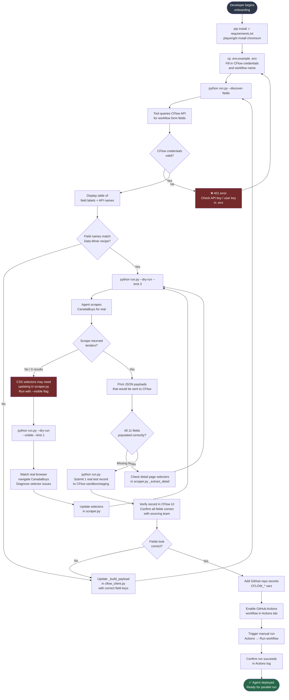
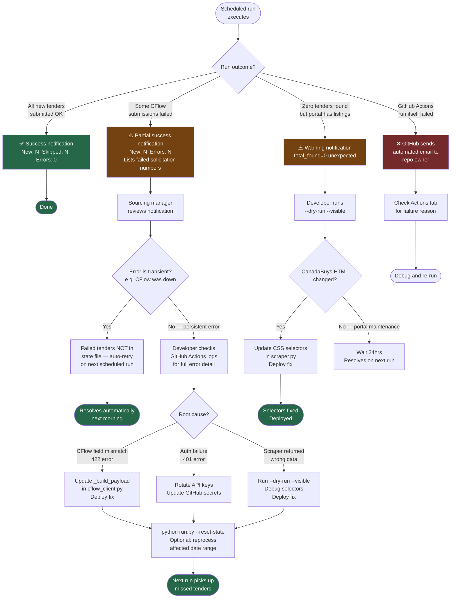
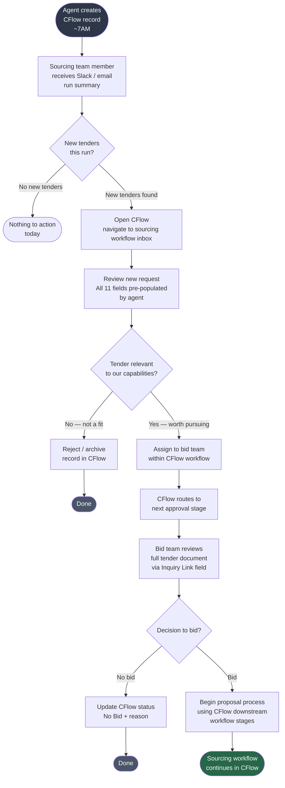
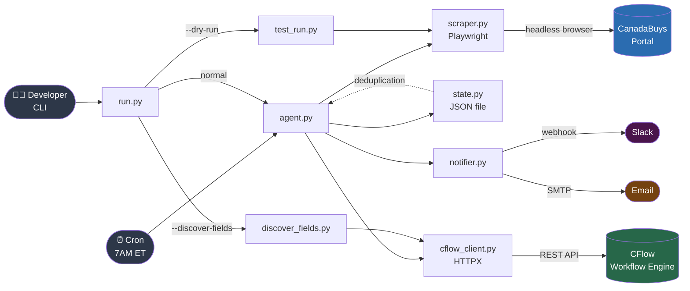

# User Flows: CanadaBuys → CFlow Sourcing Intake Agent

> Note: This is a backend agent, not a UI product. "Flows" represent system
> journeys and operator interactions rather than screen sequences. Each flow
> maps directly to a P0 user story from the PRD.

---

## Flow 1: Daily Automated Run (Primary Happy Path)

The core value loop — runs every weekday morning with zero human involvement.

```mermaid
flowchart TD
    A([⏰ GitHub Actions Cron\n7AM ET weekdays]) --> B[Load config\nfrom env vars]
    B --> C{All required env\nvars present?}
    C -->|No| ERR1[❌ Fail with clear error\nlist missing vars]
    C -->|Yes| D[Load processed_solicitations.json\ndeduplication state]
    D --> E[Launch headless\nChromium browser]
    E --> F[Navigate to CanadaBuys\nwith saved search filters]
    F --> G{Page loaded\nsuccessfully?}
    G -->|No / Timeout| ERR2[❌ Log scrape failure\nRetry once]
    ERR2 --> G2{Retry\nsucceeded?}
    G2 -->|No| NOTIFY_ERR[Send error notification\nto Slack / email]
    G2 -->|Yes| H
    G -->|Yes| H[Extract tender listings\nfrom page]
    H --> I{More pages\nto paginate?}
    I -->|Yes| F
    I -->|No| J[Combined list of\nall tenders this run]
    J --> K[For each tender:\ncheck deduplication state]
    K --> L{Solicitation No\nalready processed?}
    L -->|Yes| M[Skip — log as duplicate\nincrement skipped count]
    M --> K
    L -->|No| N[Fetch tender detail page\nfor contact + GSIN fields]
    N --> O[Map all 11 fields\nto CFlow payload]
    O --> P[POST to CFlow\nREST API]
    P --> Q{CFlow returned\n200 / 201?}
    Q -->|No| ERR3[Log error with\nsolicitation number\nincrement error count]
    ERR3 --> K
    Q -->|Yes| R[Mark solicitation as processed\nsave request ID + timestamp]
    R --> S[Increment new count]
    S --> K
    K -->|All tenders processed| T[Save updated\nprocessed_solicitations.json]
    T --> U[Build run summary\nnew / skipped / errors / total]
    U --> V[Send summary notification\nSlack and/or email]
    V --> W([✅ Run complete\nUpload logs as artifact])

    style A fill:#2d3748,color:#fff
    style W fill:#276749,color:#fff
    style ERR1 fill:#742a2a,color:#fff
    style ERR2 fill:#742a2a,color:#fff
    ERR3 fill:#742a2a,color:#fff
    style NOTIFY_ERR fill:#744210,color:#fff
```

### Key Decision Points

| Decision | Outcome |
|----------|---------|
| Missing env vars | Hard fail with explicit list of what's missing — no partial runs |
| CanadaBuys page load fails | One automatic retry, then error notification |
| More pages to paginate | Follow `rel="next"` link until exhausted or max_pages cap hit |
| Solicitation already in state file | Skip silently, count toward summary |
| CFlow API failure | Log error + solicitation number, continue to next tender (don't abort entire run) |

### Edge Cases

- **Empty results page:** If CanadaBuys returns 0 listings (e.g. portal maintenance), agent completes cleanly with `total_found=0` and sends summary noting this
- **Partial page load:** Playwright waits for `networkidle` before extracting — JS-rendered content fully loads before scraping begins
- **CFlow rate limiting:** HTTPX client has 30s timeout; if CFlow throttles, individual tender fails gracefully and is retried next run (it won't be in state yet)
- **State file corruption:** If JSON is malformed, agent starts fresh with empty state and logs a warning — worst case is re-submitting previously seen tenders once

---

## Flow 2: Developer Setup & Dry-Run Validation

The operator journey from zero to confirmed-working, before any real CFlow records are created. Covers the P1 user stories around tooling and validation.



### Edge Cases

- **CFlow field names use API keys not labels:** `discover_fields.py` displays both the human-readable label and the API key name; developer uses whichever matches CFlow's API
- **No staging environment in CFlow:** Use `CFLOW_SUBMIT_NOW=false` to create draft records instead of submitted ones; review drafts then delete before going live
- **CanadaBuys returns CAPTCHA:** Playwright handles standard CAPTCHAs; if Cloudflare protection is added, `slow_mo` setting and a brief delay between page actions will resolve it

---

## Flow 3: Failure Detection & Recovery

What happens when something breaks in production — covering the error visibility P1 user stories.



### Recovery Runbook Summary

| Error Type | Detection | Recovery | Time to Fix |
|-----------|-----------|----------|-------------|
| CFlow API down (transient) | Error count in notification | Auto-retry next run | 0 effort |
| CFlow field name mismatch (422) | Error in logs / notification | Update `_build_payload()`, deploy | ~30 min |
| CFlow auth expired (401) | Error in logs / notification | Rotate keys in GitHub Secrets | ~15 min |
| CanadaBuys HTML changed | `total_found=0` warning | Update CSS selectors in `scraper.py` | ~1–2 hrs |
| GitHub Actions quota hit | GitHub email to repo owner | Upgrade plan or self-host runner | ~30 min |
| State file corruption | Warning in logs, fresh start | Agent self-recovers; worst case: 1 duplicate run | 0 effort |

---

## Flow 4: Sourcing Team Member — Receives New Tender in CFlow

The downstream human journey — what happens after the agent does its job.



---

## System Component Inventory

Since this is a backend agent rather than a UI product, the "screen inventory" maps to system components and their interfaces.

| Component | Entry Point | Purpose | Operated By |
|-----------|------------|---------|-------------|
| `agent.py` | GitHub Actions cron / `python run.py` | Orchestrates full run | Automated (scheduled) |
| `scraper.py` | Called by agent | Launches Playwright, extracts 11 fields | Automated |
| `cflow_client.py` | Called by agent | Maps fields + POSTs to CFlow REST API | Automated |
| `state.py` / `processed_solicitations.json` | Read/written by agent | Deduplication memory across runs | Automated |
| `notifier.py` | Called by agent at end of run | Sends Slack / email run summary | Automated |
| `run.py` | CLI by developer | Manual invocation with flags (`--dry-run`, `--visible`, etc.) | Developer |
| `test_run.py` | `python run.py --dry-run` | Scrape-only validation, no CFlow side effects | Developer |
| `discover_fields.py` | `python run.py --discover-fields` | One-time CFlow field mapping tool | Developer (setup only) |
| GitHub Actions workflow | Cron / manual trigger | Scheduling, secrets injection, log archival | Automated + DevOps |
| CFlow sourcing workflow | CFlow web UI | Downstream evaluation and bid process | Sourcing team |

## Navigation Map


